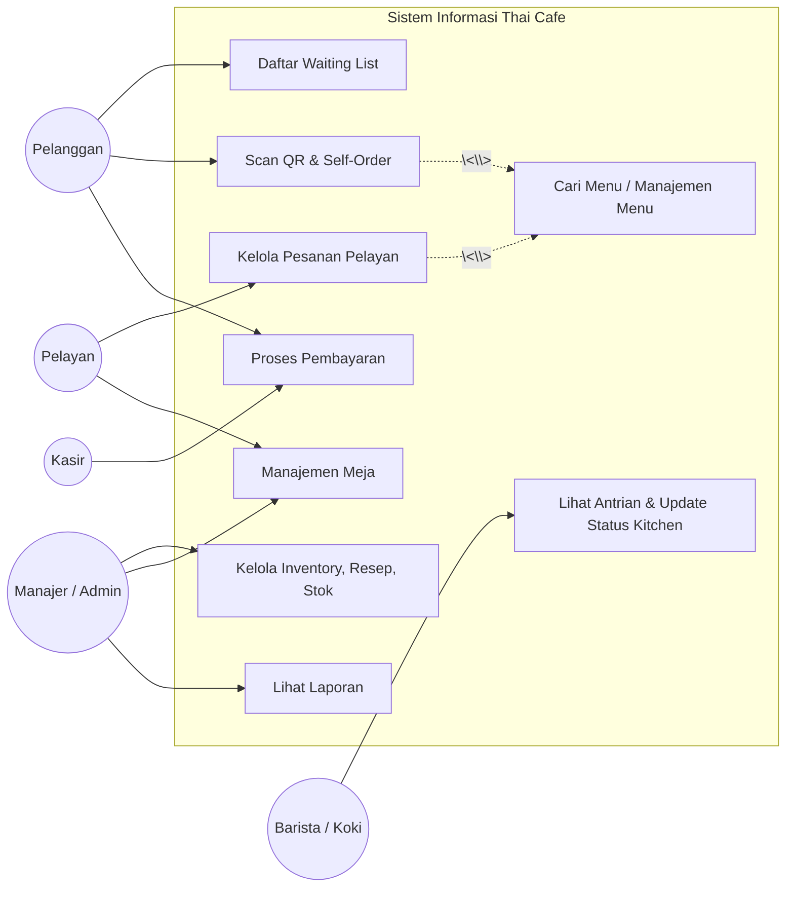
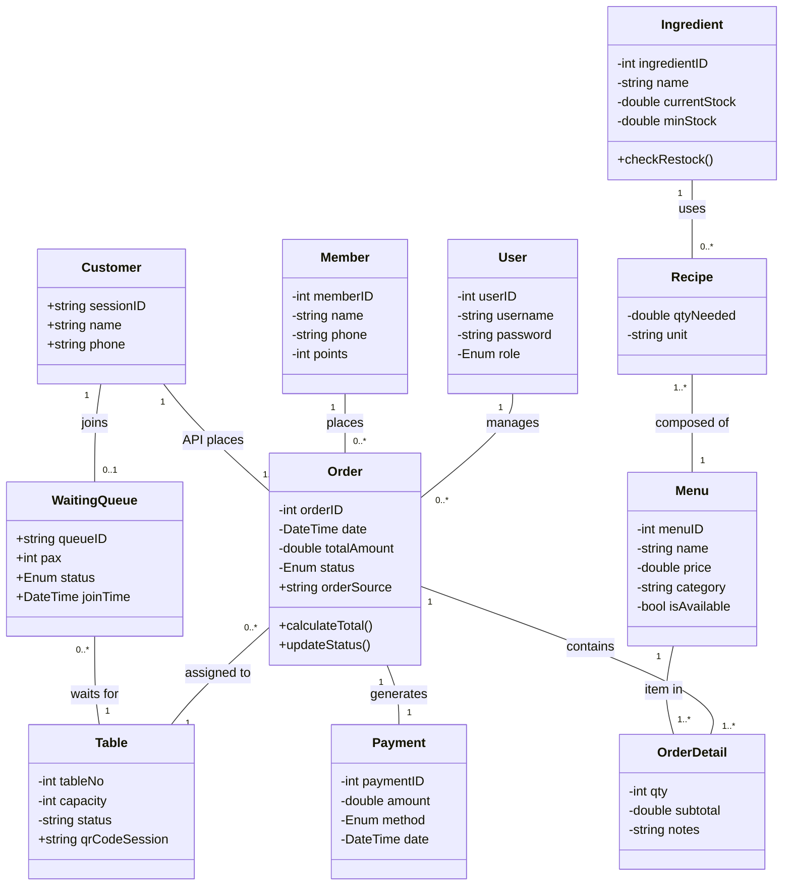

# 📝 Analisis Post-Testing & Pengembangan Sistem (Sesi 2)

> **Mata Kuliah:** Software Testing dan Quality Assurance  
> **Topik:** Analisis Kekurangan Pasca-Testing & Redesain Sistem (Penambahan Aktor Pelanggan)  
> **Proyek:** Thai Cafe — Web Point of Sale (POS)

---

## 1. Tujuan Pengembangan Perangkat Lunak

### 1.1 Analisis Kebutuhan Pengguna (User Requirements)

Berdasarkan evaluasi testing pada sistem Thai Cafe POS saat ini, sistem hanya difokuskan pada efisiensi operasional internal restoran dengan empat aktor utama: **Admin**, **Kasir**, **Pelayan (Waiter)**, dan **Barista/Koki (Kitchen)**.

**Kebutuhan Tambahan Berdasarkan Saran (Sisi Pelanggan):**
Sistem yang sekarang memiliki celah efisiensi pada pelayanan _dine-in_. Jika restoran sedang ramai (kapasitas penuh), jumlah Pelayan tidak sebanding dengan pelanggan, menyebabkan antrean panjang dan lamanya waktu tunggu pemesanan.
Oleh karena itu, dibutuhkan penambahan aktor **Pelanggan** (Customer) ke dalam sistem untuk fitur _Self-Ordering_ dan _Queue Management_.

- **Pelanggan:** Dapat mendaftar _Waiting List_ ketika meja penuh, memindai QR code meja untuk melihat menu, membuat pesanan sendiri, dan (opsional) melakukan pembayaran langsung tanpa mengantre ke kasir.

### 1.2 Analisis Proses Bisnis

**Proses Bisnis Saat Ini (As-Is):**
Semua pesanan bergantung 100% pada **Pelayan (Waiter)**. Pelayan harus menghampiri meja, memegang perangkat POS, dan meng-input pesanan satu per satu ke dalam sistem yang kemudian diproses oleh **Dapur/Kitchen** dan diakhiri dengan pembayaran di **Kasir**. Jika meja penuh, pelanggan hanya bisa menunggu manual tanpa kepastian antrean.

**Proses Bisnis Usulan (To-Be - Self-Ordering & Queueing):**

1. **Pendaftaran Antrean:** Jika kapasitas kafe penuh, Pelanggan mendaftar masuk ke _Virtual Waiting List_ di sistem (melalui kios depan/scan QR antrean). Sistem memberikan nomor antrean dan estimasi waktu, lalu menotifikasi pelanggan ketika meja sudah _available_.
2. **Self-Ordering:** Pelanggan yang sudah duduk memindai QR Code unik di meja, langsung mengakses menu digital, memilih makanan/minuman, dan sistem otomatis melakukan pemotongan stok bahan baku di gudang.
3. **Penyajian & Pembayaran:** Dapur menerima order dan merubah status menjadi "Ready". Pelanggan dapat menyelesaikan pembayaran sendiri (_Self-Pay_) di meja atau membayarnya di Kasir di akhir sesi makan.

---

## 2. Analisis Kembali Model Desain (Redesain Modifikasi)

Melakukan penyesuaian dari **semua diagram UML sebelumnya**, agar secara utuh dapat mengakomodasi aktor baru (**Pelanggan**) dan fitur **Waiting List**. Seluruh variabel atribut dan nama aktor telah diselaraskan dengan arsitektur sistem awal.

### 2.1 Use Case Diagram (Update)

Memasukkan Pelanggan (_Customer_) berdampingan dengan Admin, Kasir, Pelayan, dan Barista/Koki.

### 2.2 Class Diagram (Revisi Terintegrasi)

Penambahan Class **Customer** dan **WaitingQueue**, serta modifikasi relasi dengan Class **Order** dan **Table** pada struktur database yang lama.

### 2.3 Activity Diagram: Self Rule Ordering & Auto Stock Deduction

Disediakan dalam bentuk format file XML yang **kompatibel dengan Draw.io**. Anda dapat membukanya dan melakukan "Copy-Paste" (atau `Insert -> From Text`) langsung ke _worksheet_ diagram Anda.

[Unduh: Activity Diagram (XML)](file:///d:/AntigravityAI-Agent/ansi-thai-cafe/file/DIAGRAM_ACTIVITY_SELF_ORDER.xml)

### 2.4 Sequence Diagram: Proses Self-Ordering & Queueing

Skenario alur rinci (antrean awal hingga notifikasi pesanan matang) disediakan dalam format file XML **Draw.io**.

[Unduh: Sequence Diagram (XML)](file:///d:/AntigravityAI-Agent/ansi-thai-cafe/file/DIAGRAM_SEQUENCE_SELF_ORDER.xml)

### 2.5 Solusi & Manajemen Kondisi "Ruangan Penuh"

Berdasarkan _note_ dan skenario dosen, manajemen puncak antrean akan ditangani melalui **Sistem Antrean Prioritas Digital** sebagai berikut:

1. **Pemisahan Tipe Order:** Order untuk _Dine-in_ dibedakan dengan mendaftar Pax/Meja, sedangkan untuk _Takeaway_ Pelanggan tidak memegang _Table Status_ (langsung masuk ke queue dapur).
2. **QR Code Antrean Dinamis:** Pada kondisi puncak, Kios kasir atau _waiter_ depan akan mencetak QR Waiting List (via Thermal Printer). Pelanggan menscan QR tersebut dengan HP mereka.
3. **Pemesanan di Muka (Pre-order dari Antrean):** Sebagai _work-around_ paling mutakhir, sembari menunggu (_Waiting List_), akses menu sudah dibuka. Pelanggan bisa memesan duluan. Begitu meja tersedia, pesanan otomatis di-_flush_ ke dapur dari _Pending Queue_. Ini mempercepat pergantian tempat duduk (Turn-around rate meja).

---

_Dokumen Analisis UML ini dirancang selaras (sinkron) dengan diagram struktural proyek (`.mxfile`) yang asli._
