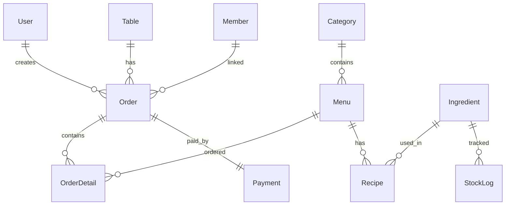
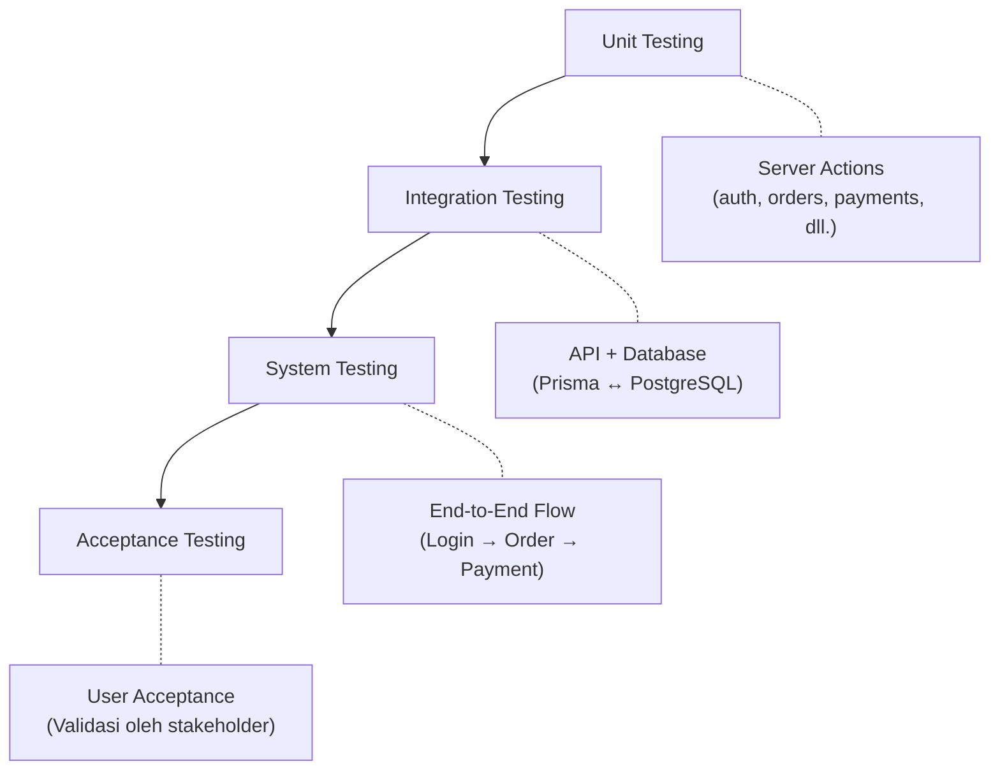
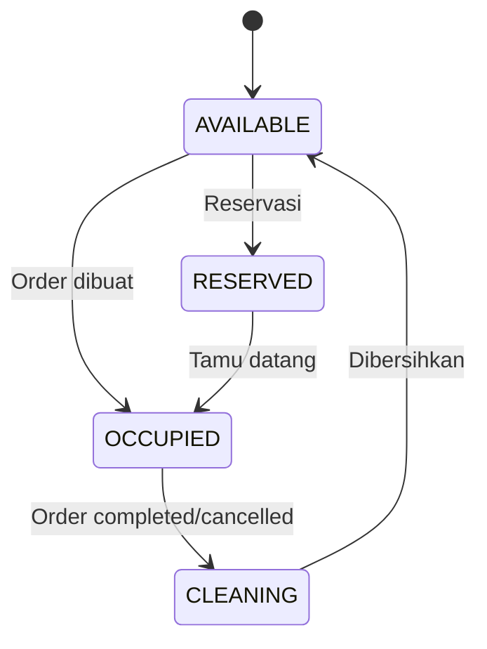
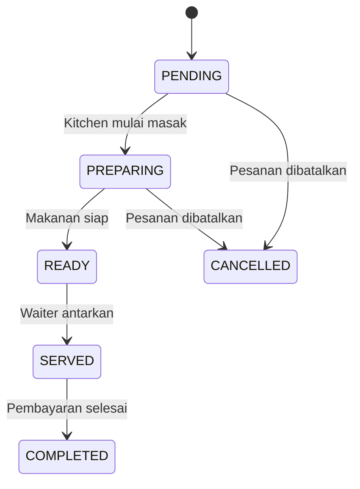

# 📋 Perencanaan Testing — Thai Cafe POS System

> **Mata Kuliah:** Software Testing dan Quality Assurance  
> **Aplikasi:** Thai Cafe — Web Point of Sale (POS)  
> **Tech Stack:** Next.js 16.1, TypeScript, Prisma ORM, PostgreSQL (Supabase), Tailwind CSS 4  
> **Live URL:** [https://thai-cafe-pos.vercel.app/](https://thai-cafe-pos.vercel.app/)

---

## 1. Deskripsi Sistem

**Thai Cafe POS** adalah sistem Point of Sale berbasis web untuk manajemen restoran yang mendukung 4 peran pengguna:

| Role        | Fungsi Utama                                                                           |
| ----------- | -------------------------------------------------------------------------------------- |
| **Admin**   | Manajemen menu, kategori, meja, member, inventori, resep, users, dan laporan penjualan |
| **Kasir**   | Proses pembayaran (Cash/QRIS), ringkasan harian, dan riwayat transaksi                 |
| **Waiter**  | Input pesanan, pemilihan meja, dan monitoring status order                             |
| **Kitchen** | Display pesanan masuk, update status memasak, dan completed orders                     |

### Modul & Fitur

| Modul                | Fitur                                                                                     |
| -------------------- | ----------------------------------------------------------------------------------------- |
| **Autentikasi**      | Login, logout, session management (cookie-based), role-based access control               |
| **Manajemen Menu**   | CRUD menu, CRUD kategori, toggle availability                                             |
| **Manajemen Meja**   | CRUD meja, update status (Available/Occupied/Reserved/Cleaning)                           |
| **Manajemen Member** | CRUD member, poin loyalitas (add/redeem), statistik member                                |
| **Inventori**        | CRUD bahan baku, stock log (IN/OUT), low stock alert, recipe/BOM                          |
| **Order**            | Buat pesanan, tambah/hapus item, update status (Pending→Preparing→Ready→Served→Completed) |
| **Pembayaran**       | Proses pembayaran, laporan harian, ringkasan pendapatan per periode                       |
| **Dashboard Admin**  | Ringkasan penjualan, statistik, menu terlaris                                             |

### Database Schema (11 Models)



---

## 2. Tujuan Testing

1. **Memastikan fungsionalitas** semua fitur sesuai dengan requirement
2. **Memvalidasi role-based access** control bekerja dengan benar
3. **Menguji integritas data** pada seluruh operasi CRUD
4. **Memverifikasi business logic** (kalkulasi harga, manajemen stok, poin member)
5. **Menguji UI/UX** responsivitas dan user experience
6. **Mengidentifikasi bug** dan potensi error sebelum deployment

---

## 3. Ruang Lingkup Testing (Scope)

### ✅ Dalam Scope

- Functional testing seluruh modul
- UI/UX testing
- Role-based access control testing
- Database integrity testing
- Business logic testing
- Boundary value analysis
- Equivalence partitioning
- Error handling testing

### ❌ Di Luar Scope

- Performance/load testing
- Security penetration testing
- Automated testing implementation
- Mobile native testing (hanya web)

---

## 4. Strategi Testing

### 4.1 Teknik Testing yang Digunakan

| Teknik                       | Tipe             | Diterapkan Pada                  |
| ---------------------------- | ---------------- | -------------------------------- |
| **Black-Box Testing**        | Functional       | Seluruh modul                    |
| **Equivalence Partitioning** | Black-Box        | Input form (login, CRUD)         |
| **Boundary Value Analysis**  | Black-Box        | Numerik (harga, qty, stok, poin) |
| **Decision Table Testing**   | Black-Box        | Login, pembayaran, status order  |
| **State Transition Testing** | Black-Box        | Status order, status meja        |
| **Use Case Testing**         | Black-Box        | Skenario end-to-end              |
| **Error Guessing**           | Experience-based | Seluruh modul                    |

### 4.2 Level Testing



---

## 5. Pembagian Tugas Kelompok (5-6 Orang)

| No  | Anggota                    | Peran Testing                    | Modul yang Diuji                                                |
| --- | -------------------------- | -------------------------------- | --------------------------------------------------------------- |
| 1   | **Anggota 1**              | Test Lead / Test Manager         | Koordinasi, review seluruh test case, pelaporan                 |
| 2   | **Anggota 2**              | Tester — Autentikasi & User Mgmt | Login, logout, session, role-based access, CRUD users           |
| 3   | **Anggota 3**              | Tester — Menu & Kategori         | CRUD menu, CRUD kategori, toggle availability                   |
| 4   | **Anggota 4**              | Tester — Order & Kitchen         | Buat pesanan, update status order, kitchen display, waiter flow |
| 5   | **Anggota 5**              | Tester — Pembayaran & Member     | Proses payment, laporan harian, CRUD member, poin loyalitas     |
| 6   | **Anggota 6** _(opsional)_ | Tester — Meja & Inventori        | CRUD meja, status meja, CRUD ingredient, stock log, recipe      |

---

## 6. Test Case Design

### 6.1 Modul Autentikasi (Login/Logout)

#### Equivalence Partitioning — Login

| ID         | Partisi                           | Kelas   | Input                                   | Expected Result                                   |
| ---------- | --------------------------------- | ------- | --------------------------------------- | ------------------------------------------------- |
| TC-AUTH-01 | Username valid + Password valid   | Valid   | username: "admin", password: "admin123" | Login berhasil, redirect ke dashboard sesuai role |
| TC-AUTH-02 | Username valid + Password invalid | Invalid | username: "admin", password: "salah"    | Pesan error "Username atau password salah"        |
| TC-AUTH-03 | Username invalid + Password valid | Invalid | username: "xxxxx", password: "admin123" | Pesan error "Username atau password salah"        |
| TC-AUTH-04 | Username kosong + Password kosong | Invalid | username: "", password: ""              | Validasi form / pesan error                       |
| TC-AUTH-05 | Username valid + Password kosong  | Invalid | username: "admin", password: ""         | Validasi form                                     |

#### Decision Table — Login

| Kondisi             | R1           | R2    | R3    | R4    |
| ------------------- | ------------ | ----- | ----- | ----- |
| Username terdaftar? | ✅           | ✅    | ❌    | ❌    |
| Password cocok?     | ✅           | ❌    | ✅    | ❌    |
| **Aksi**            | Login sukses | Error | Error | Error |

#### Test Case — Role-Based Access

| ID         | Skenario                         | Langkah                                     | Expected Result                     |
| ---------- | -------------------------------- | ------------------------------------------- | ----------------------------------- |
| TC-AUTH-06 | Admin akses halaman admin        | Login sebagai Admin → navigasi ke /admin    | Halaman admin tampil                |
| TC-AUTH-07 | Kasir akses halaman admin        | Login sebagai Kasir → navigasi ke /admin    | Redirect ke /unauthorized           |
| TC-AUTH-08 | Waiter akses halaman kasir       | Login sebagai Waiter → navigasi ke /cashier | Redirect ke /unauthorized           |
| TC-AUTH-09 | Kitchen akses halaman waiter     | Login sebagai Kitchen → navigasi ke /waiter | Redirect ke /unauthorized           |
| TC-AUTH-10 | User belum login akses dashboard | Tanpa login → akses /admin                  | Redirect ke /login                  |
| TC-AUTH-11 | Logout                           | Klik tombol logout                          | Session dihapus, redirect ke /login |

---

### 6.2 Modul Manajemen Menu

#### CRUD Menu — Test Cases

| ID         | Skenario                  | Input / Langkah                                     | Expected Result                              |
| ---------- | ------------------------- | --------------------------------------------------- | -------------------------------------------- |
| TC-MENU-01 | Tambah menu valid         | name: "Pad Thai", price: 35000, category: "Makanan" | Menu berhasil ditambahkan                    |
| TC-MENU-02 | Tambah menu tanpa nama    | name: "", price: 35000                              | Validasi error, nama wajib diisi             |
| TC-MENU-03 | Tambah menu harga 0       | name: "Test", price: 0                              | Validasi error / menu ditambahkan (boundary) |
| TC-MENU-04 | Tambah menu harga negatif | name: "Test", price: -5000                          | Validasi error                               |
| TC-MENU-05 | Edit menu                 | Ubah nama "Pad Thai" → "Pad Thai Special"           | Menu berhasil diperbarui                     |
| TC-MENU-06 | Hapus menu                | Hapus menu "Pad Thai Special"                       | Menu terhapus dari database                  |
| TC-MENU-07 | Toggle availability       | Klik toggle pada menu aktif                         | Status berubah menjadi tidak tersedia        |
| TC-MENU-08 | Tambah menu duplikat nama | name: "Pad Thai" (sudah ada)                        | Menu dibuat (nama tidak unique) atau error   |

#### Boundary Value Analysis — Harga Menu

| ID             | Input Harga | Expected                           |
| -------------- | ----------- | ---------------------------------- |
| TC-MENU-BVA-01 | -1          | Ditolak / Error                    |
| TC-MENU-BVA-02 | 0           | Boundary — perlu ditentukan policy |
| TC-MENU-BVA-03 | 1           | Diterima                           |
| TC-MENU-BVA-04 | 999999      | Diterima                           |
| TC-MENU-BVA-05 | 1000000     | Boundary atas — diterima/ditolak   |

---

### 6.3 Modul Manajemen Meja

| ID          | Skenario                          | Input / Langkah                         | Expected Result             |
| ----------- | --------------------------------- | --------------------------------------- | --------------------------- |
| TC-TABLE-01 | Tambah meja valid                 | tableNo: 1, capacity: 4, zone: "floor1" | Meja berhasil ditambahkan   |
| TC-TABLE-02 | Tambah meja nomor duplikat        | tableNo: 1 (sudah ada)                  | Error unique constraint     |
| TC-TABLE-03 | Tambah meja capacity 0            | tableNo: 99, capacity: 0                | Boundary — diterima/ditolak |
| TC-TABLE-04 | Update status meja                | AVAILABLE → OCCUPIED                    | Status berubah              |
| TC-TABLE-05 | Hapus meja yang punya order aktif | Hapus meja dengan order PENDING         | Error foreign key / dicegah |
| TC-TABLE-06 | Update meja valid                 | Ubah capacity 4 → 6                     | Data meja diperbarui        |

#### State Transition — Status Meja



| ID             | Transisi             | Expected                         |
| -------------- | -------------------- | -------------------------------- |
| TC-TABLE-ST-01 | AVAILABLE → OCCUPIED | Valid                            |
| TC-TABLE-ST-02 | AVAILABLE → RESERVED | Valid                            |
| TC-TABLE-ST-03 | OCCUPIED → CLEANING  | Valid (saat order completed)     |
| TC-TABLE-ST-04 | CLEANING → AVAILABLE | Valid                            |
| TC-TABLE-ST-05 | OCCUPIED → AVAILABLE | Invalid (harus melalui CLEANING) |
| TC-TABLE-ST-06 | CLEANING → OCCUPIED  | Invalid                          |

---

### 6.4 Modul Order (Pesanan)

#### State Transition — Status Order



#### Test Cases — Order

| ID        | Skenario                          | Input / Langkah                           | Expected Result                       |
| --------- | --------------------------------- | ----------------------------------------- | ------------------------------------- |
| TC-ORD-01 | Buat order valid                  | tableId valid, items: [{menuId, qty: 2}]  | Order dibuat, totalAmount dihitung    |
| TC-ORD-02 | Buat order tanpa items            | tableId valid, items: []                  | Error / order tidak dibuat            |
| TC-ORD-03 | Buat order qty negatif            | qty: -1                                   | Validasi error                        |
| TC-ORD-04 | Buat order dengan member          | tableId + memberId valid                  | Order dibuat, terhubung ke member     |
| TC-ORD-05 | Update status PENDING → PREPARING | updateOrderStatus(id, "PREPARING")        | Status berubah                        |
| TC-ORD-06 | Update status PREPARING → READY   | updateOrderStatus(id, "READY")            | Status berubah                        |
| TC-ORD-07 | Update status COMPLETED           | updateOrderStatus(id, "COMPLETED")        | Status berubah, meja → CLEANING       |
| TC-ORD-08 | Update status CANCELLED           | updateOrderStatus(id, "CANCELLED")        | Status berubah, meja → CLEANING       |
| TC-ORD-09 | Tambah item ke order              | addOrderItem(orderId, {menuId, qty: 1})   | Item ditambahkan, totalAmount updated |
| TC-ORD-10 | Hapus item dari order             | removeOrderItem(orderDetailId)            | Item dihapus, totalAmount dikurangi   |
| TC-ORD-11 | Kalkulasi total                   | 2x Pad Thai (35000) + 1x Thai Tea (15000) | totalAmount = 85000                   |

#### Boundary Value Analysis — Quantity

| ID            | Input Qty | Expected           |
| ------------- | --------- | ------------------ |
| TC-ORD-BVA-01 | -1        | Ditolak            |
| TC-ORD-BVA-02 | 0         | Boundary — ditolak |
| TC-ORD-BVA-03 | 1         | Diterima           |
| TC-ORD-BVA-04 | 100       | Diterima           |
| TC-ORD-BVA-05 | 999       | Boundary atas      |

---

### 6.5 Modul Pembayaran

#### Decision Table — Pembayaran

| Kondisi        | R1             | R2                      | R3                   | R4    |
| -------------- | -------------- | ----------------------- | -------------------- | ----- |
| Order ada?     | ✅             | ❌                      | ✅                   | ✅    |
| Belum dibayar? | ✅             | -                       | ❌                   | ✅    |
| Metode valid?  | ✅             | -                       | -                    | ❌    |
| **Aksi**       | Payment sukses | Error "Order not found" | Error "Already paid" | Error |

#### Test Cases — Pembayaran

| ID        | Skenario                  | Input / Langkah                | Expected Result                     |
| --------- | ------------------------- | ------------------------------ | ----------------------------------- |
| TC-PAY-01 | Bayar Cash sukses         | orderId valid, method: "CASH"  | Payment dibuat, order → COMPLETED   |
| TC-PAY-02 | Bayar QRIS sukses         | orderId valid, method: "QRIS"  | Payment dibuat, order → COMPLETED   |
| TC-PAY-03 | Bayar order tidak ada     | orderId: "invalid"             | Error "Order not found"             |
| TC-PAY-04 | Bayar order sudah dibayar | orderId yang sudah ada payment | Error "Order already paid"          |
| TC-PAY-05 | Bayar dengan member       | orderId + memberId valid       | Payment dibuat + member terhubung   |
| TC-PAY-06 | Laporan harian            | getDailyPayments(today)        | List pembayaran hari ini            |
| TC-PAY-07 | Summary per periode       | getPaymentSummary(start, end)  | Total transaksi, amount, cash, qris |

---

### 6.6 Modul Member & Poin Loyalitas

| ID        | Skenario                     | Input / Langkah                    | Expected Result             |
| --------- | ---------------------------- | ---------------------------------- | --------------------------- |
| TC-MBR-01 | Tambah member valid          | name: "Budi", phone: "08123456789" | Member berhasil ditambahkan |
| TC-MBR-02 | Tambah member phone duplikat | phone: "08123456789" (sudah ada)   | Error unique constraint     |
| TC-MBR-03 | Tambah member tanpa nama     | name: "", phone: "081234"          | Validasi error              |
| TC-MBR-04 | Edit member                  | Ubah nama "Budi" → "Budi Santoso"  | Data diperbarui             |
| TC-MBR-05 | Hapus member                 | Hapus member                       | Member terhapus             |
| TC-MBR-06 | Tambah poin                  | addPoints(id, 100)                 | points bertambah 100        |
| TC-MBR-07 | Redeem poin valid            | poin cukup, redeemPoints(id, 50)   | points berkurang 50         |
| TC-MBR-08 | Redeem poin melebihi saldo   | poin: 30, redeem: 50               | Error "Insufficient points" |
| TC-MBR-09 | Redeem poin = 0              | redeemPoints(id, 0)                | Boundary — diterima/ditolak |

#### Boundary Value Analysis — Poin

| ID            | Poin Saat Ini | Redeem | Expected                    |
| ------------- | ------------- | ------ | --------------------------- |
| TC-MBR-BVA-01 | 100           | 100    | Berhasil, sisa 0            |
| TC-MBR-BVA-02 | 100           | 101    | Error "Insufficient points" |
| TC-MBR-BVA-03 | 0             | 1      | Error "Insufficient points" |
| TC-MBR-BVA-04 | 100           | 0      | Boundary — validasi         |

---

### 6.7 Modul Inventori & Recipe (BOM)

| ID        | Skenario                           | Input / Langkah                      | Expected Result                         |
| --------- | ---------------------------------- | ------------------------------------ | --------------------------------------- |
| TC-INV-01 | Tambah ingredient valid            | name: "Beras", unit: "kg", stock: 50 | Berhasil ditambahkan                    |
| TC-INV-02 | Tambah ingredient duplikat nama    | name: "Beras" (ada)                  | Error unique constraint                 |
| TC-INV-03 | Update stok (IN)                   | addStockLog: type IN, qty: 20        | currentStock bertambah 20, log tercatat |
| TC-INV-04 | Update stok (OUT)                  | addStockLog: type OUT, qty: 10       | currentStock berkurang 10, log tercatat |
| TC-INV-05 | Low stock alert                    | currentStock ≤ minStock              | Muncul di getLowStockIngredients        |
| TC-INV-06 | Tambah recipe                      | menuId + ingredientId + qtyNeeded    | Recipe (BOM) ditambahkan                |
| TC-INV-07 | Recipe duplikat                    | menu + ingredient yang sama          | Error unique constraint                 |
| TC-INV-08 | Deduct stok saat order             | Order 2x menu dengan recipe          | Stok bahan baku terpotong sesuai BOM    |
| TC-INV-09 | Hapus ingredient yang punya recipe | Hapus bahan baku terkait menu        | Error / cascade behavior                |

---

### 6.8 Modul Manajemen User (Admin)

| ID        | Skenario          | Input / Langkah             | Expected Result           |
| --------- | ----------------- | --------------------------- | ------------------------- |
| TC-USR-01 | Lihat daftar user | Akses halaman users (Admin) | List user tampil          |
| TC-USR-02 | Tambah user baru  | username, password, role    | User berhasil ditambahkan |
| TC-USR-03 | Username duplikat | Username yang sudah ada     | Error unique constraint   |
| TC-USR-04 | Edit user         | Ubah role Waiter → Kasir    | Data diperbarui           |
| TC-USR-05 | Hapus user        | Hapus user non-admin        | User terhapus             |

---

## 7. Skenario End-to-End (E2E)

### Skenario 1: Alur Lengkap Order sampai Pembayaran

```
1. Waiter login
2. Waiter pilih meja (status AVAILABLE)
3. Waiter buat order (pilih menu + qty)
4. Sistem hitung totalAmount otomatis
5. Order masuk ke Kitchen display (status PENDING)
6. Kitchen update status → PREPARING
7. Kitchen update status → READY
8. Waiter update status → SERVED
9. Kasir login
10. Kasir proses pembayaran (Cash/QRIS)
11. Order status → COMPLETED
12. Meja status → CLEANING
13. Admin set meja kembali → AVAILABLE
```

### Skenario 2: Order dengan Member

```
1. Kasir proses payment dengan memberId
2. Member terhubung ke order
3. Poin loyalty bertambah (jika diimplementasi di payment flow)
```

### Skenario 3: Inventori — Stok Terpotong

```
1. Admin setup ingredient + recipe (BOM)
2. Waiter buat order menu yang punya recipe
3. Sistem potong stok ingredient sesuai BOM
4. Stok bahan baku berkurang
5. Jika stok ≤ min → muncul di low stock alert
```

---

## 8. Test Environment

| Komponen        | Detail                                                                        |
| --------------- | ----------------------------------------------------------------------------- |
| **OS**          | Windows 10/11                                                                 |
| **Browser**     | Google Chrome (terbaru), Firefox, Edge                                        |
| **Backend**     | Next.js 16.1 (Node.js 18+)                                                    |
| **Database**    | PostgreSQL via Supabase                                                       |
| **URL Testing** | `http://localhost:3000` (dev) atau `https://thai-cafe-pos.vercel.app/` (prod) |
| **Tools**       | DevTools Browser, Prisma Studio                                               |

---

## 9. Jadwal Testing

| Minggu       | Aktivitas                                            | PIC                   |
| ------------ | ---------------------------------------------------- | --------------------- |
| **Minggu 1** | Penyusunan test plan & test case                     | Seluruh anggota       |
| **Minggu 2** | Eksekusi test — Auth & User Mgmt, Menu & Kategori    | Anggota 2, 3          |
| **Minggu 3** | Eksekusi test — Order & Kitchen, Pembayaran & Member | Anggota 4, 5          |
| **Minggu 4** | Eksekusi test — Meja & Inventori, E2E Testing        | Anggota 6, Seluruh    |
| **Minggu 5** | Bug reporting, re-testing, UAT                       | Seluruh anggota       |
| **Minggu 6** | Penyusunan laporan akhir                             | Test Lead (Anggota 1) |

---

## 10. Template Bug Report

| Field                  | Contoh                                                                     |
| ---------------------- | -------------------------------------------------------------------------- |
| **Bug ID**             | BUG-001                                                                    |
| **Judul**              | Login berhasil dengan password kosong                                      |
| **Modul**              | Autentikasi                                                                |
| **Severity**           | Critical                                                                   |
| **Priority**           | High                                                                       |
| **Precondition**       | User "admin" sudah ada di database                                         |
| **Steps to Reproduce** | 1. Buka /login 2. Isi username "admin" 3. Kosongkan password 4. Klik Login |
| **Expected Result**    | Pesan error validasi                                                       |
| **Actual Result**      | Login berhasil tanpa password                                              |
| **Screenshot**         | _(lampirkan)_                                                              |
| **Status**             | Open / Fixed / Closed                                                      |
| **Assigned To**        | Developer                                                                  |

### Severity Level

| Level        | Deskripsi                                  |
| ------------ | ------------------------------------------ |
| **Critical** | Sistem crash, data hilang, security breach |
| **Major**    | Fitur utama tidak berfungsi                |
| **Minor**    | Fitur berfungsi tapi tidak sesuai UI/UX    |
| **Trivial**  | Typo, warna salah, cosmetic issue          |

---

## 11. Kriteria Testing

### Entry Criteria (Syarat Mulai)

- ✅ Aplikasi sudah bisa diakses (localhost / production)
- ✅ Database sudah terisi data seed
- ✅ Test case sudah ditulis dan di-review
- ✅ Semua tester sudah memahami requirement

### Exit Criteria (Syarat Selesai)

- ✅ Semua test case telah dieksekusi
- ✅ Tidak ada bug severity Critical yang belum di-fix
- ✅ Bug Major ≤ 2 (belum di-fix tapi di-acknowledge)
- ✅ Pass rate ≥ 85%
- ✅ Laporan testing final sudah disusun

---

## 12. Deliverables

| No  | Dokumen                 | Format              |
| --- | ----------------------- | ------------------- |
| 1   | Test Plan (dokumen ini) | .md / .docx         |
| 2   | Test Case Detail        | Spreadsheet (.xlsx) |
| 3   | Test Execution Report   | Spreadsheet (.xlsx) |
| 4   | Bug Report              | Spreadsheet (.xlsx) |
| 5   | Test Summary Report     | .md / .docx         |

---

## 13. Risiko Testing

| Risiko                               | Dampak              | Mitigasi                                     |
| ------------------------------------ | ------------------- | -------------------------------------------- |
| Database Supabase tidak bisa diakses | Testing terhambat   | Gunakan database lokal / environment berbeda |
| Perubahan kode saat testing          | Test case outdated  | Freeze code sebelum testing, atau retest     |
| Anggota kelompok tidak hadir         | Modul tidak tertest | Backup tester untuk setiap modul             |
| Data seed tidak lengkap              | Test case gagal     | Pastikan seed mencakup semua skenario        |

---

> [!IMPORTANT]
> Dokumen ini adalah **perencanaan testing** yang mencakup seluruh aspek pengujian untuk Thai Cafe POS. Setiap anggota kelompok harus memahami modul yang ditugaskan dan mengeksekusi test case sesuai jadwal. Temuan bug harus dilaporkan menggunakan template yang disediakan.
